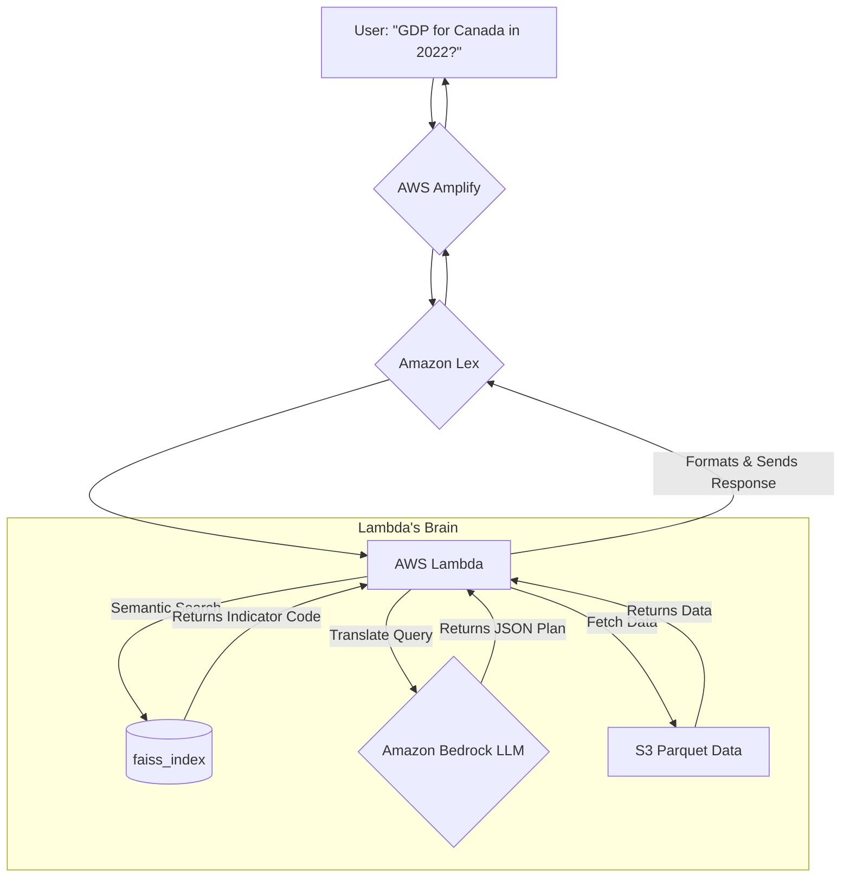

# GlobalPulse 📈

A friendly, serverless AI agent that lets you have a natural language conversation with World Bank economic data.

Have you ever wanted to ask a question about global economics without digging through complex spreadsheets? That's the idea behind GlobalPulse. This project started from a simple request from a friend: "Can you help me pull data from the World Bank into a specific Excel format?"

What began as a simple data-pulling task evolved into a smart, conversational AI agent that can understand your questions and provide answers in plain text, in-chat tables, or even as a downloadable Excel report.

## 🚀 Try the Live Demo!

Seeing is believing! The chatbot is live and ready for you to try.

**Live Demo URL:** **[https://main.d2e73777ni07tt.amplifyapp.com/](https://main.d2e73777ni07tt.amplifyapp.com/)**

*(Feel free to add a GIF of your chatbot in action here!)*

> ### Example Prompts to Get You Started:
>
> *   `what was access to electricity in Brazil 10 years ago?`
> *   `What was mobile subscriptions and access to electricity for Canada and Armenia for the last 3 years`
> *   `What indicators do you have available?`
> *   `all GDP indicators for United States for last 10 years`

---

## 🤔 A Different Approach: Why Not Just RAG?

While building chatbots, I've had great success using Retrieval-Augmented Generation (RAG) to "chat" with unstructured documents like PDFs and websites. So, why not here?

The answer lies in the data itself.
*   **RAG is fantastic for unstructured text**, like a librarian who can read thousands of books and find the right paragraph to answer your question.
*   The World Bank data, however, is **highly structured**: a massive collection of numbers, countries, and years in a precise table format.

Feeding this structured, numerical data to a standard RAG pipeline can lead to model **hallucinations** and inaccurate results. The model might try to "creatively interpret" the numbers instead of just retrieving them.

So, I took a different path. Instead of a librarian, I built a system where the AI acts as a smart **"Query Translator"** that figures out exactly what you want, and a robust backend acts as a **"Query Engine"** to fetch the precise data.

## 🏛️ How It Works: A Two-Phase Architecture

This project is built in two distinct phases: an **offline data preparation phase** where we build the foundation, and a **live query processing phase** where the chatbot answers user questions.

### Phase 1: Offline Data Preparation (The Foundation)

Before the chatbot can answer a single question, we need to transform the raw World Bank Excel files into a format that is optimized for fast and intelligent lookups. This is handled by two key Python scripts:

1.  **`process_data.py` - The Data Engineer:**
    *   **What it does:** This script takes the main data sheet—a massive table with indicators as rows and years as columns—and completely restructures it. It cleans the data and pivots it into a "long" format, which is ideal for database queries.
    *   **The result:** The script outputs the data to AWS S3 as a **partitioned Parquet dataset**. Think of this as a highly efficient filing cabinet where all the data for a single indicator (like GDP) is stored in its own dedicated folder. This makes fetching data for a specific indicator incredibly fast.

2.  **`create_vector_index.py` - The AI Librarian:**
    *   **What it does:** A user might ask for "GDP," "Gross Domestic Product," or "the size of the economy." How do we know they all mean the same thing? This script solves that problem. It reads the metadata file containing the names and long descriptions of every indicator.
    *   For each indicator's text, it uses an Amazon Bedrock embedding model (`amazon.titan-embed-text-v2:0`) to create a "semantic fingerprint"—a numerical vector that represents the meaning of the text.
    *   **The result:** The script produces two crucial files stored in S3:
        *   `index.faiss`: A **vector index** that stores all these "fingerprints" in a way that allows for near-instant similarity searching.
        *   `faiss_id_to_metadata.json`: A map that links the IDs in the FAISS index back to the actual indicator codes (e.g., `NY.GDP.MKTP.CD`).

With this foundation in place, our chatbot is ready to go live.

### Phase 2: Live Query Processing (The Chatbot in Action)

Here’s what happens step-by-step when you ask the chatbot a question:



1.  **The Journey Begins:** Your question travels from the browser, through **AWS Amplify**, to **Amazon Lex**, which recognizes the intent to query data and invokes our main **AWS Lambda** function.

2.  **Semantic Search:** The Lambda function first needs to understand what indicator you're asking about. It takes your query ("GDP for Canada in 2022"), creates an embedding (a semantic fingerprint) for it, and uses the `index.faiss` vector database to find the most similar indicator description. This search returns the official code, `NY.GDP.MKTP.CD`, even though you didn't use it.

3.  **LLM as a Query Planner:** With the correct indicator code identified, the Lambda function now needs to understand the rest of your request. It sends the original query and the candidate indicator(s) to an LLM on **Amazon Bedrock (Llama 3)**. The LLM's only job is to act as a "Query Translator," converting your question into a structured JSON plan:
    ```json
    {
      "indicators": ["NY.GDP.MKTP.CD"],
      "countries": ["Canada"],
      "start_year": 2022,
      "end_year": 2022
    }
    ```

4.  **The Data Fetch:** The Lambda function now acts as a "Query Engine." Using the clean JSON plan, it queries the partitioned Parquet dataset on S3. It goes directly to the `NY.GDP.MKTP.CD` folder, filters for "Canada" and "2022," and gets the data instantly.

5.  **Formatting the Response:** The function inspects the request. Since this is a single data point, it formats a simple text response. For more complex queries, it might build an HTML table or generate an entire Excel report, upload it to S3, and create a secure download link.

6.  **The Journey Home:** The final, user-friendly response is sent back through Lex and Amplify to your chat window.

## ✨ Key Features

*   ✅ **Natural Language Queries:** Ask for data like you'd ask a person.
*   ✅ **Multiple Response Formats:**
    *   **Simple Text:** For single data points.
    *   **HTML Tables:** For multi-year data for a single indicator.
    *   **Excel Reports:** For complex queries involving multiple indicators or countries.
*   ✅ **Conversational Context:** The bot can ask clarifying questions (e.g., "Do you want a list of all indicators?") and understand your "yes/no" follow-up.
*   ✅ **Broad Data Requests:** Ask for "all indicators" for a country to get a comprehensive report.
*   ✅ **Fully Serverless:** No servers to manage, and you only pay for what you use.


## 🚀 Future Improvements

While GlobalPulse is a fully functional agent, there are many exciting paths for future development. Here are a few ideas that build on the current architecture:

*   **Advanced Data Aggregation and Analysis**
    *   **The Idea:** Go beyond simple data retrieval and allow the user to perform calculations directly.
    *   **The Solution:** Enhance the LLM's "Query Planner" to recognize and extract aggregation intents. The Lambda function would then perform calculations on the retrieved data. This would enable powerful queries like:
        *   "What was the **average** GDP of Brazil, Argentina, and Chile over the last 10 years?"
        *   "Show me the **maximum** inflation rate for Canada since 2000."
        *   "What was the **total** population of all Nordic countries in 2023?"

*   **In-Chat Data Visualization**
    *   **The Idea:** Instead of just returning tables or Excel files, the agent could generate and display charts directly in the chat.
    *   **The Solution:** The Lambda function could use a library like `Matplotlib` or `Seaborn` to create a chart (e.g., a line graph for a multi-year trend), save it as an image to S3, and return an `` tag with a pre-signed URL to display it in the chat window.

*   **Multi-Source Data Federation**
    *   **The Idea:** Expand the agent's knowledge beyond the World Bank.
    *   **The Solution:** Incorporate other structured economic datasets from sources like the **International Monetary Fund (IMF)** or the **OECD**. This would involve creating new data processing pipelines and expanding the vector index to include metadata from these new sources, turning GlobalPulse into an even more powerful economic research tool.

*   **Enhanced Conversational Memory**
    *   **The Challenge:** The current agent treats most queries as standalone requests.
    *   **The Solution:** Implement a proper conversational memory using **Amazon DynamoDB**. This would allow for natural follow-up questions like:
        *   User: "What was the GDP of Canada in 2022?"
        *   Agent: *(Responds with the data)*
        *   User: "What about for Germany?" (The agent would remember the indicator and year).

*   **Proactive User Guidance with Suggestion Buttons**
    *   **The Idea:** Make the agent even more user-friendly by suggesting next steps.
    *   **The Solution:** After providing an answer, the agent could offer clickable suggestion buttons in the UI, such as "Compare with another country," "Show this data as a chart," or "See related indicators." This would guide the user's data exploration journey and make the chatbot feel more interactive.

## 📝 Developer's Notes & Key Learnings

This project was a fantastic learning experience. Here are a few key takeaways:

*   💡 **Choosing the Right LLM is a Balancing Act.** While testing, I found that the state-of-the-art **Claude 3.5 Sonnet** model was incredibly reliable at generating clean JSON, but it was also significantly more expensive than other models. Models like **Llama 3** proved to be the sweet spot, offering great instruction-following at a fraction of the cost.
*   💡 **Older Models Struggle with Instruction Following.** Early experiments with models like `gpt-oss-20b` showed that while they were decent at reasoning, they often failed to stick to strict output formats (like "JSON only"), causing frequent parsing errors. Modern, instruction-tuned models are essential for this kind of agentic work.
*   💡 **Embrace Docker for AWS Lambda.** AWS Lambda has a hard limit of 256 MB for the unzipped size of a function and its layers. When using data science libraries like `pandas` and `pyarray`, you will hit this limit almost immediately. The solution is to deploy your Lambda function as a **Docker container image**, which gives you a much larger size limit (up to 10 GB).

## 📜 License

This project is open-sourced under the **MIT License**. Feel free to use, modify, and distribute the code. If you find it useful, an attribution would be greatly appreciated! See the `LICENSE` file for more details.